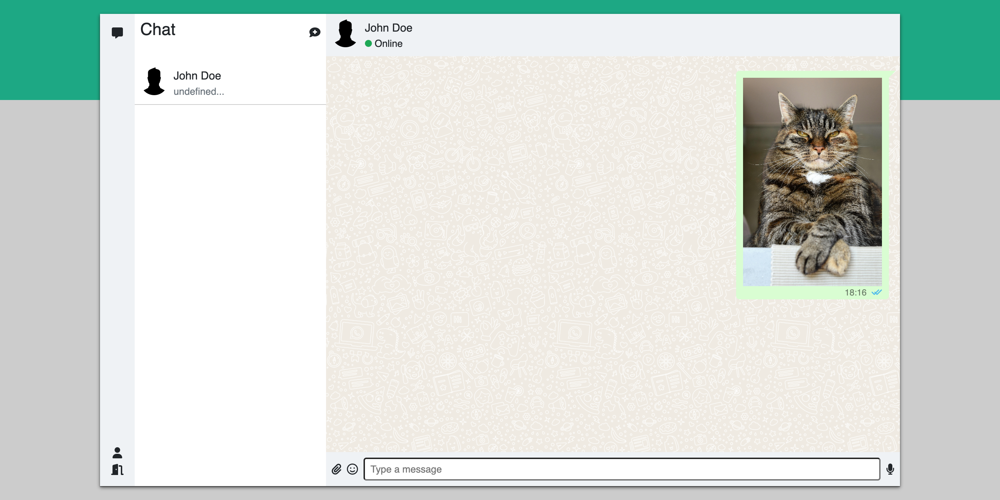
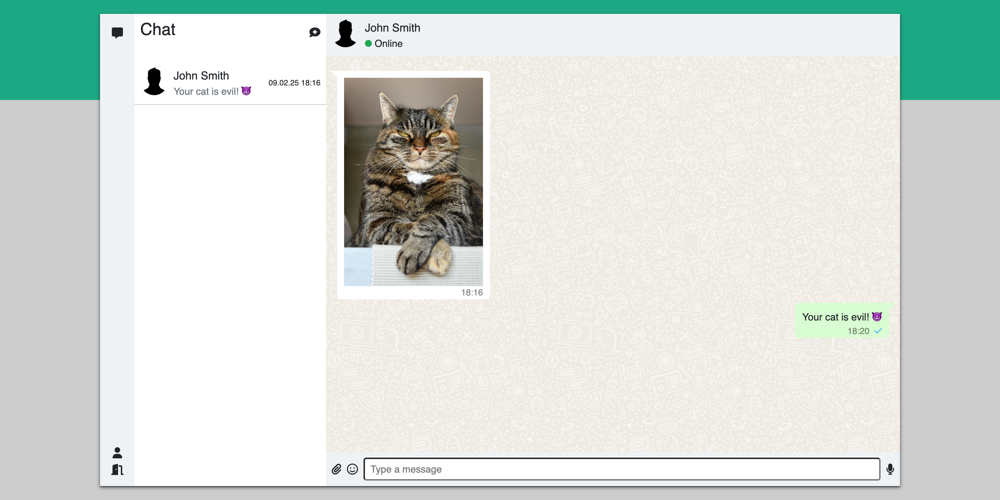

# <samp>OVERVIEW</samp>

Chat application powered by Angular and Spring.



# <samp>FEATURES</samp>

- Spring Boot backend
- Keycloak authentication
- Angular dynamic frontend
- Bootstrap responsive UI

# <samp>GUIDANCE</samp>

### Launch the containers

```shell
docker compose up -d
```
